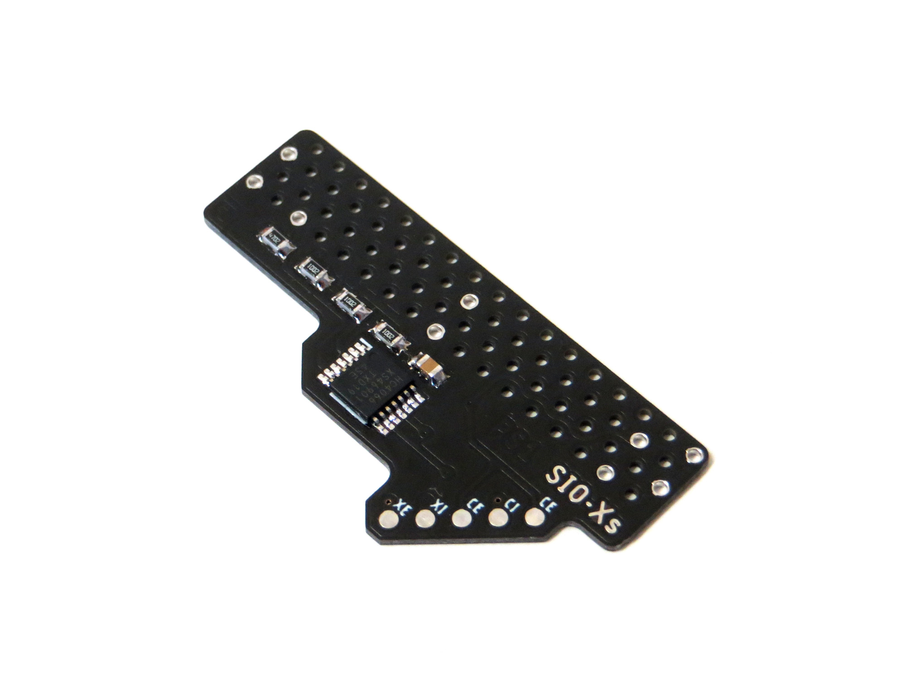

# Sony PlayStation SIO-XS PSIO Quick Solder Switchboard

SIO-X is an elegant PSIO switchboard designed by Voultar to make switchboard installs simpler and neater. It comes with the addition of an on-board modchip, quick solder board design, and a number of other improvements over the standard PSIO switchboard.

## What is SIO-XS?

For my own uses I prefer a separate modchip install so I decided to design the SIO-XS. The SIO-SX simplifies Voultar’s PSIO switchboard design by omitting the modchip and changing the layout a little. My design is focused on making installs as aesthetically pleasing as possible so an additional wire pad was added to prevent any crossed wire runs as well as 45 degree pad placement so wires can be run to the back of the pads or to the front of them. Check the install photos folder to see how these design ideas work in practice.

## Why is it called SIO-XS?

SIO-XS for eXtra Small. SIO-XS for Sans, in that it is sans-modchip. SIO-XS in that it removes the ‘excess’ so it is just a PSIO switchboard.

## Version History

- SIO-XS v1.0 - 30/09/2021
- SIO-XS v1.1 - 10/06/2023

## Credits and Attributions

SIO-XS was designed from the ground up but is based entirely on Voultar’s work and SIO-X. So all credit to Voultar.

## License

If you use this in any way, shape or form, you must include a link back to this repository and mention me by name on any sales pages and social media posts. Not only will this help me to keep designing mod kits and offering them to the community, but it is basic common courtesy as well. Don't be a douchebag. :)

## Donate

Working on designs to release for free can be both time consuming and expensive. If you like what I do, a small donation will go a long way in helping me continue to serve the modding community as best as I can, with many more free and original guides, designs, and ideas to come.

